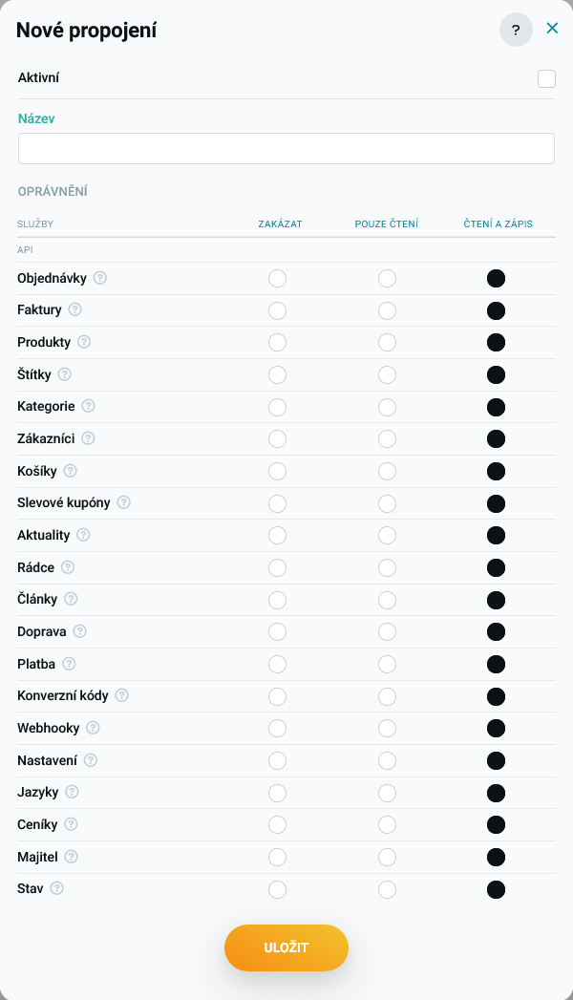
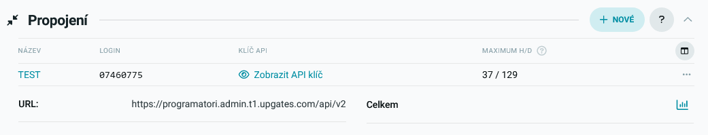
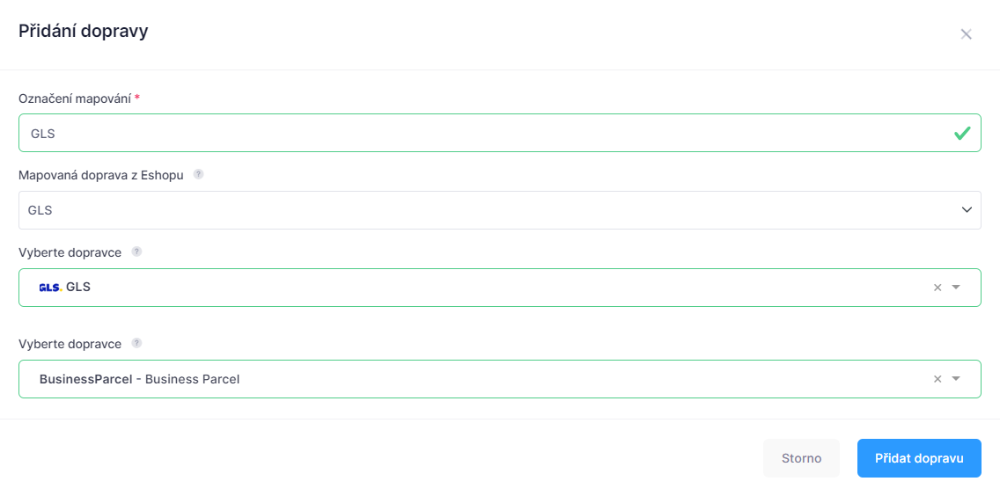

---
sidebar_position: 1
---

# Upgates

Upgates je poskytovatel eshopových řešení nejen v České republice, ale i v zahraničí. Díky aktivace aplikace **Upgates** získáte možnost

## Základní informace
| Informace |  |
| ----------- | ----------- |
| Název aplikace | **Upgates** |
| Kód aplikace | **`UPGATES`** |
| Webové stránky | [www.upgates.cz ↗️](https://www.upgates.cz/) |
| Stav | ✅️ Implementováno | 

## Aktivace aplikace

Aktivovat aplikaci si můžete v naší administraci v sekci **Nastavení** -> **Aplikace** -> **Přidat aplikaci** -> **Upgates**. 
Pro aktivaci aplikace budete potřebovat přístupové údaje k API rozhraní Upgates. Tyto údaje získáte v administraci svého obchodu v sekci **Doplňky** ->
**API**.

Více informací o API přístupech v eshopovém řešení Upgates nalenete na adrese [https://www.upgates.cz/api-v2 ↗️](https://www.upgates.cz/api-v2) nebo v 
oficiální dokumentaci na [https://upgatesapiv2.docs.apiary.io ↗️](https://upgatesapiv2.docs.apiary.io)

### Vytvoření přístupových údajů 

Pro úspěšné napojení na Upgates potřebujete vytvořit si nový Token. Postup vytvoření nového tokenu, pokud již nemáte existující je následující:

1. Nový token si vytvoříte v sekci **API** kliknutím na tlačítko **+ Nové**. 
2. Do pole **Název** zadejte textový popis, který vám pomůže identifikovat token.
3. Vyberte oprávnění, které tento token bude nabízet. Pro správnout funkčnost systému potřebujeme vybrat minimálně:
	* **Objednávky** -> **Čtení a  zápis**
	* **Produkty** -> **Čtení a  zápis**
	* **Kategorie** -> **Čtení a  zápis**
	* **Doprava** -> **Pouze čtení**
	* **Platba** -> **Pouze čtení**
	* **Webhooky** -> **Pouze čtení**
	* **Ceníky** -> **Pouze čtení**
	* **Majitel** -> **Pouze čtení**
4. Pokud nechcete nastavit jednotlivá oprávnění, můžete nastavit všechna oprávnění. Napojení na **Upgates** neustále rozšiřujeme a může se stát,
že v budoucnu budete potřebovat další oprávnění.

### Získání přístupových údajů
V seznamu **Propojení** se nově vytvořený token zobrazí. V seznamu naleznete **Login** a **Klíč API**, který zobrazíte kliknutím na tlačítko **Zobrazit API klíč**.

## Nastavení aplikace
Pro nastavení/aktivaci aplikace je třeba zadat **Doména nebo označení eshopu**. Tato hodnotav tuto chvíli slouží jako identifikátor, ke které aplikaci patří objednávka. 
Jako další hodnotu můžete zvolit **Poznámka**, která se zobrazí v přehledu aplikací.

### Přihlašovací údaje
V této sekci je třeba nastvit přihlašovací údaje do API Upgates, které jste si nastavili/vygenerovali v předchozím kroku. Zadávat budete:
1. **API Login** - Jedná se o textovou hodnotu, kterou vygenerovala administrace Upgates
2. **API Klíč** - Jedná se o textovou hodnotu, kterou vygenerovala administrace Upgates
3. **Název eshopu** - Název/označení eshopu. Je to textová hodnota v URL ve tvaru `https://<nazeveshopu>.admin.<znackaserveru>.upgates.com`
4. **Značka serveru** - Textová hodnota názvu serveru, na kterém je Váš eshop hostován. Může se jednat o hodnoty např. `t1`, `s50` apod.

### Kontaktní údaje
Pokud jste vytvořenému tokenu přiřadili práva na čtení vlastníka eshopu, zobrazí se zde informace o vlastníkovi eshopu. Tyto informace se propisuji 
do našich formulářů na tisk potvrzení objednávky apod.

### Doprava
V sekci **Doprava** se provádí mapování dopravy z Upgates na dopravu v Balíkuj. Základem je vytvoření nové dopravy kliknutím na tlačítko **Přidat dopravu**.
Systém Balíkuj podporuje řadu dopravců a je třeba systému sdělit, jakou dopravu eshopu chcete mapovat na jakého dopravce a přepravní službu v Balíkuj.

Nové mapování přidáte kliknutím na tlačítko **Přidat dopravu**.

V dialogovém okně, které se Vám zobrazí zadejte:
* **Označení mapování** - Vaše označení mapování - nikde se nepropisuje, pouze informativní charakter
* **Mapovaná doprava z eshopu** - Zde vyberte dopravní službu, která se načte ze seznamu dopravců Vašeho eshopu. Vybrat můžete i několik různých dopravců a sdružit je pod jednoho dopravce v systému Balíku
* **Vyberte dopravce** - Vyberte dopravce, kterého máte v Balíkuj aktivovaného a na kterého chcete mapovat zvolenou dopravu
* **Vyberte službu** - Vyberte službu daného dopravce, která bude použita pro vytvoření zásilek

Vše potvrdíte kliknutím na tlačítko **Přidat dopravu**.
